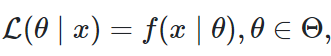
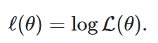
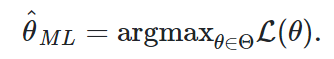
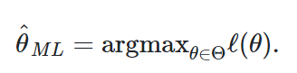
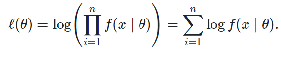
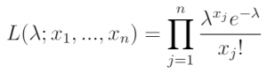
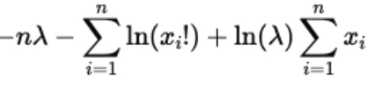
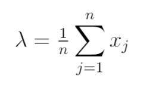

```{r setup, include=FALSE}
knitr::opts_chunk$set(echo = TRUE)
```


# 1. Introduzione

Dato un modello statistico parametrico utilizziamo i dati campionari a disposizione per scegliere tra tutti i possibili valori del parametro, quello che è più vicino al valore vero.

La stima puntuale dei parametri è suddivisa in due momenti:

* Metodi di costruzione degli stimatori;
* Valutazione degli stimatori basata sull’incertezza e bontà rispetto ad alcuni criteri.

Per la costruzione degli stimatori introduciamo il concetto di funzione di verosimiglianza.


La ***funzione di verosimiglianza***, è la funzione di probabilità condizionata dei dati *x* vista come una funzione del parametro sconosciuto $\theta$.
Spesso per indicare la verosimiglianza si scrive $L(\theta)$ se è chiaro a quali valori *x* ci si riferisce.



Geometricamente possiamo vedere la verosimiglianza *L* come una curva (in generale, una superficie) nello spazio del parametro $\theta$ (in generale, dei parametri ) che riflette la plausibilità relativa dei valori $\theta$ alla luce dei dati osservati.

La funzione $L(θ∣x)$ non è una funzione di densità. Infatti, essa non racchiude un’area unitaria.

La funzione di verosimiglianza ci dice quanto possiamo ritenere “relativamente plausibili” i diversi valori del parametro $\theta$ alla luce dei dati osservati.

&nbsp;  

## 1.1 Log-verosimiglianza

&nbsp;
Possiamo utilizzare anche una versione modificata della funzione di verosimiglianza basata sul logaritmo.
Non è necessario lavorare con i logaritmi (è consigliato per praticità dei calcoli), e questo perché i valori della verosimiglianza, in cui si moltiplicano valori di probabilità molto piccoli, possono diventare estremamente piccoli (qualcosa come $10^{-34}$).

In tali circostanze, non è sorprendente che i programmi dei computer mostrino problemi di arrotondamento numerico.
Le trasformazioni logaritmiche risolvono questo problema.

&nbsp;  

## 1.2 Stima della massima verosimiglianza MLE

La funzione di verosimiglianza rappresenta la “verosimiglianza relativa” dei diversi valori del parametro di interesse.
L'obiettivo è trovare un modo per scegliere il valore *migliore* tra tutti i possibili. 
&nbsp;
Il metodo della massima verosimiglianza *MLE* consiste nel trovare il valore $\theta$ che più verosimilmente ha generato i dati. Tale stima corrisponde al **punto di massimo** della funzione di verosimiglianza.



Il punto che nello spazio dei parametri massimizza la funzione è chiamato **stimatore di massima verosimiglianza**.

Poiché il logaritmo è una funzione strettamente crescente (usualmente si considera il logaritmo naturale), allora $L(\theta)$ e $ℓ(\theta)$ assumono il massimo (o i punti di massimo) in corrispondenza degli stessi valori di $\theta$.
 


Per le proprietà del logaritmo, si ha:


 

Ci sono diversi problemi nella stima della massima verosimiglianza legati al tipo di insieme (aperto/chiuso) e all’esplicitazione come funzione dei dati campionari.

Le famiglie *regolari* sono famiglie parametriche per le quali la stima di verosimiglianza di $\theta$ esiste ed è unica. Per questa categoria di famiglie è più facile nella maggior parte dei casi massimizzare la funzione di log-verosimiglianza.

Si parla invece di verosimiglianza *multimodale* se la stima di massima verosimiglianza può esistere ma non essere unica.

In alcune situazioni è quindi possibile trovare in modo esplicito il massimo della verosimiglianza.
Nei casi in cui non sia possibile il calcolo esplicito, ricorreremo a **metodi di massimizzazione numerica**.

&nbsp;  

## 1.3 Metodi del primo e del secondo ordine

Qualsiasi metodo numerico che richieda almeno una derivata prima o il calcolo del gradiente è definito come un *algoritmo del primo ordine*.
Nel caso di un problema di ottimizzazione a somma finita, è possibile utilizzare solo il gradiente di un singolo campione.

Un *metodo del secondo ordine* è invece un qualsiasi algoritmo che utilizza la derivata seconda, nel caso scalare (nel passo di Newton è richiesto l’uso della matrice hessiana che ha derivate del secondo ordine).

L’ordine di un algoritmo può essere visto come l’ordine di errore risultante dall’approssimazione della derivata (utilizzando una $\epsilon$ di approssimazione per ogni derivata, otterremo un $\epsilon$ quadratico corrispondente all’errore dell’algoritmo di ottimizzazione).

Gli algoritmi del primo ordine non convergono necessariamente in modo lineare, come ad esempio il metodo di discesa stocastica del gradiente (*SGD*) che converge sub-linearmente.

Gli algoritmi di ottimizzazione tendono ad essere di tipo iterativo.

I metodi iterativi sono procedure per passi costruiti nel seguente modo:

* Si parte da una proposta di stima iniziale per i parametri;
* Ad ogni passo vengono calcolate delle nuove stime che serviranno come punto di partenza al nuovo giro;
* La procedura va avanti fino a quando la differenza tra la stima ottenuta al passo h−1 e quella al passo h è minore di un prefissato valore piccolo (tolleranza del metodo);
* La stima finale è quella per la quale viene soddisfatto il criterio di tolleranza.

\newpage

# 2. Algoritmi

## 2.1 Metodo della discesa del gradiente (GD)

In ottimizzazione ed analisi numerica il metodo di discesa del gradiente, detto anche metodo di discesa più ripida, è una tecnica che consente di determinare i punti di massimo e minimo di una funzione di più variabili. 

Questo metodo è il più utilizzato per minimizzare la funzione costo,(molto utilizzato nel campo delle reti neurali) e ciò avviene aggiornando i parametri relativi alla funzione in direzione opposta rispetto al gradiente della funzione stessa.

È possibile individuare tre varianti del metodo di discesa del gradiente che differiscono per il numero di dati utilizzati nel calcolo del gradiente della funzione.

+	Discesa stocastica del gradiente (SGD);
+	Discesa del gradiente mini-batch (MBGD);
+	Discesa stocastica media del gradiente (SAG);


## 2.2 Metodo della discesa stocastica del gradiente (SGD)

Quando si ha un grande numero di parametri e di training points, calcolare il vettore gradiente ad ogni iterazione del metodo di discesa può essere estremamente costoso.

Una alternativa più economica può essere sostituire la media dei gradienti individuali calcolata su tutti i training points con il gradiente di un singolo training point scelto casualmente. 

Questa modifica apportata introduce nuovo metodo conosciuto come metodo di discesa stocastica del gradiente o stochastic gradient descent (SGD). 


## 2.3 Algoritmo di Newton-Raphson (NR)

Il metodo di Newton-Raphson è un metodo risolutivo basato su un’approssimazione del secondo ordine della funzione obiettivo da minimizzare. 

Per ottenere tale approssimazione si considera lo sviluppo di Taylor della funzione di log-verosimiglianza (l) fino al second’ordine.

Essendo il metodo pensato per la minimizzazione di una funzione, per poter ottenere le stime di massima verosimiglianza dobbiamo considerare come funzione obiettivo l’opposto della log-verosimiglianza (−l).

Il metodo di Newton è molto efficiente perché richiede solo una singola iterazione per raggiungere il punto, ma risulta essere computazionalmente costoso (richiede una gran quantità di memoria per memorizzare matrici NxN).


## 2.4 Berndt–Hall–Hall–Hausman (BHHH)

L'algoritmo Berndt-Hall-Hall-Hausman (BHHH) è un algoritmo di ottimizzazione numerica simile all'algoritmo di Newton-Raphson, ma sostituisce la matrice Hessiana negativa osservata con il prodotto esterno del gradiente. 

Questa approssimazione si basa sull'uguaglianza della matrice di informazione ed è quindi valida solo durante la massimizzazione di una funzione di verosimiglianza. 

L'algoritmo BHHH prende il nome dai quattro ideatori: Ernst R. Berndt, Bronwyn Hall, Robert Hall e Jerry Hausman.


## 2.5 Davidon–Fletcher–Powell (DFP)

La formula di Davidon-Fletcher-Powell (DFP) trova la soluzione dell'equazione secante più vicina alla stima corrente e che soddisfa la condizione di curvatura. 

È stato il primo metodo quasi-Newton a generalizzare il metodo della secante a un problema multidimensionale.

Questo aggiornamento mantiene la simmetria e la definitività positiva della matrice Hessiana.


## 2.6 Broyden–Fletcher–Goldfarb–Shanno (BFGS)

Nell'ottimizzazione numerica, l'algoritmo Broyden-Fletcher-Goldfarb-Shanno (BFGS) è un metodo iterativo per risolvere problemi di ottimizzazione non lineare non vincolati. 

Come il metodo Davidon-Fletcher-Powell, il BFGS determina la direzione di discesa precondizionando il gradiente con informazioni sulla curvatura. 

Lo fa migliorando gradualmente un'approssimazione alla matrice Hessiana della funzione di perdita, ottenuta solo da valutazioni del gradiente (o valutazioni approssimate del gradiente) attraverso un metodo secante generalizzato.


## 2.7 Nelder–Mead (NM)

Il metodo Nelder-Mead (anche metodo del simoletto in discesa, metodo dell'ameba o metodo del politopo) è un metodo numerico comunemente applicato per trovare il minimo o il massimo di una funzione obiettivo in uno spazio multidimensionale. 

È un metodo di ricerca diretta (basato sul confronto di funzioni) e viene spesso applicato a problemi di ottimizzazione non lineare per i quali le derivate possono non essere note. 

Tuttavia, la tecnica Nelder-Mead è un metodo di ricerca euristico che può convergere a punti non stazionari su problemi che possono essere risolti con metodi alternativi.

La tecnica Nelder-Mead è stata proposta da John Nelder e Roger Mead nel 1965.

## 2.8 Simulated anneling (SNN)

Il simulated annealing (ricottura simulata) è una strategia utilizzata per risolvere problemi di ottimizzazione, che mira a trovare un minimo globale quando si è in presenza di più minimi locali.

Il concetto di annealing ("ricottura") deriva dalla scienza dei metalli, dov'è usato per descrivere il processo di eliminazione di difetti reticolari dai cristalli tramite riscaldamento seguito da lento raffreddamento. In questo caso un difetto reticolare corrisponde ad una combinazione errata di due oggetti (ad esempio una connessione errata di due neuroni all'interno di una rete neurale).


# 3. Librerie in R

## 3.1 maxLik: introduzione

Il pacchetto R maxLik è stato progettato per fornire una singola e unificata interfaccia per differenti metodi di ottimizzazione, e per trattare i risultati in maniera adatta per la stima della massima verosimiglianza (ML).

La libreria implementa un tipo di routine ottimizzata per il metodo di Newton-Raphson nella funzione *maxNRCompute*.

La funzione non può essere invocata direttamente se non utilizzando una comoda interfaccia utente fornita dalla funzione *maxNR*.

Questo algoritmo di tipo Newton-Raphson è utilizzato anche come base della funzione *maxBHHH*, che implementa un algoritmo di tipo Berndt-Hall-Hall-Hausman (paragrafo 2.4). 

Inoltre sono disponibili  delle funzioni apposite per il metodo di Broyden-Fletcher-Goldfarb-Shanno (paragrafo 2.6),per la routine Nelder-Mead (paragrafo 2.7) e per il metodo di simulated annealing (paragrafo 2.8), rispettivamente nelle funzioni *maxBFGS*, *maxNM* e *maxSANN*.

Queste tre funzioni sono prevalentemente funzioni wrapper attorno alla funzione interna *maxOptim*, che richiama la funzione optim (dal pacchetto integrato **stats**) per l'ottimizzazione vera e propria.

Il pacchetto maxLik fornisce un'ulteriore implementazione dell'ottimizzatore BFGS, *maxBFGSR*, che a differenza dei metodi basati su ottimo è scritto esclusivamente in R.

### 3.1.1 maxLik: struttura

Il pacchetto maxLik è progettato in due strati. 
Il primo (il più interno) è lo _strato di ottimizzazione_ (massimizzazione): tutte le routine di massimizzazione sono state progettate in modo da avere un'interfaccia unica e intuitiva che permette all'utente di passare facilmente fra di esse. 

Queste funzioni possono essere utilizzate per diversi tipi di compiti di ottimizzazione, sia correlati che non correlati alla probabilità. Restituiscono un oggetto S3 di classe *maxim* che comprende sia i parametri stimati parametri stimati e varie informazioni diagnostiche.

Il secondo strato è quello della _massimizzazione della verosimiglianza_. Lo strumento più importante di questo livello è la funzione *maxLik.* Il suo scopo principale è quello di trattare gli ingressi e i risultati della massimizzazione in un modo specifico per la ML.

### 3.1.2 maxLik: utilizzo

Come per tutti i pachetti di R, maxLik deve essere installato e caricato prima dell'utilizzo.
```{r maxLik, message = FALSE, warning = FALSE}
library( "maxLik" )
```
La funzione che ci permette di avere un'interfaccia utente ha lo stesso nome della libreria, maxLik.
Questa funzione ha due parametri obbligatori per l'invocazione: **logLik** e **start**.
Il primo argomento (logLik) dovrebbe essere una funzione che calcola il valore della log-verosimiglianza come funzione del parametro.
Il secondo argomento (start) dovrebbe essere un vettore di valori iniziali di partenza.

### 3.1.3 maxLik: summary,print,fixed

Utilizzando il parametro **summary** abbiamo la possibilità di stampare il numero delle iterazioni per tutti i metodi presenti all'interno della libreria.
Il significato di iterazione potrebbe cambiare al variare della tecnica di ottimizzazione selezionata.

maxLik supporta tanti altri argomenti, molti dei quali vengono passati alla tecnica. 
Uno dei più importanti è **print.level** che controlla le informazioni di debugging in output.

E' possibile mantenere alcuni parametri fissati come costanti nel processo di ottimizzazione.
Questa feature è implementata in tutti i metodi supportati da maxLik.
Attraverso l'argomento *fixed* della funzione possiamo specificare i parametri fissati in 3 modi diversi:

+  passando un vettore logico avente le stesse dimensioni del vettore dei parametri;

+  l'argomento *fixed* può essere un vettore di indici che indica la posizione dei parametri fissati;

+  l'argomento può essere un vettore di stringhe di caratteri, indicante i nomi dei parametri da fissare.

Nelle precedenti versioni di maxLik (<=0.6), i parametri potevano essere fissati solo nelle funzioni *maxNR* e *maxBHHH* usando l'argomento **activePar** (vettore logico che indicava i parametri da non fissare). 

### 3.1.4 maxLik: method

Con il parametro **method** si intende il metodo di massimizzazione, attualmente "NR" (per Newton-Raphson), "BFGS" (per Broyden-Fletcher-Goldfarb-Shanno), "BFGSR" (per l'algoritmo BFGS implementato in R), "BHHH" (per Berndt-Hall-Hall-Hausman), "SANN" (per Simulated ANNealing), "CG" (per Conjugate Gradients) o "NM" (per Nelder-Mead). 

Il metodo predefinito è "NR" per i problemi non vincolati e "NM" o "BFGS" per i problemi vincolati, a seconda che sia stato fornito l'argomento grad. "BHHH" è una buona alternativa, dato che la verosimiglianza viene restituita in base alle osservazioni.

La discesa stocastica del gradiente (SGD) non è attualmente supportata poiché questo metodo sembra essere raramente utilizzato per la stima della massima verosimiglianza.


### 3.1.5 maxLik: altre librerie

Esistono diverse librerie che utilizzano il pacchetto maxLik per la stima della massima verosimiglianza (censReg, mhurdle, mlogitBMA, pglm, sampleSelection, truncreg).


## *censReg*

Questa libreria usufruisce strettamente del package *maxLik*.
Il modello è valutato con la massima verosimiglianza (ML) assumendo una distribuzione gaussiana (normale) del termine di errore.
La massimizzazione della funzione di verosimiglianza viene effettuata dalla funzione maxLik del pacchetto
maxLik. È possibile utilizzare l'argomento aggiuntivo, method, per specificare il metodo di ottimizzazione utilizzato da maxLik, ad esempio "NR", "BHHH", "BFGS", "SANN" (per la ricottura simulata) o "NM" (per la funzione Nelder).

## *mhurdle*

In questa libreria vengono utilizzati due tipi di algoritmi per la stima della massima verosimiglianza. Il primo tipo di algoritmo è il "metodo di Newton". Ad ogni iterazione, la matrice Hessiana della log-verosimiglianza viene calcolata, utilizzando le derivate seconde o il prodotto esterno del gradiente (metodo Berndt, Hall, Hall, Hausman o metodo BHHH). Il problema di questo algoritmo, già esplicitato nei precedenti paragrafi è  che può avere scarse prestazioni e fallire dopo poche iterazioni.

Il secondo algoritmo è il metodo di Broyden, Fletcher, Goldfarb, Shanno o BFGS, aggiorna a ogni iterazione una stima della matrice Hessiana della log-likelihood. Spesso è più robusto e può funzionare meglio nei casi in cui i formatori non funzionano.


## 3.2 likelihood: introduzione

Il pacchetto R *likelihood* permette di trovare una stima per la massima verosimiglianza sfruttando modelli che utilizzano il simulated annealing (paragrafo 2.8) e algoritmi di ottimizzazione globale.

La funzione di verosimiglianza è difficile da analizzare con metodi matematici, come il calcolo delle derivate.
Inoltre, spesso presenta una topologia complessa nello spazio dei parametri, con massimi locali e altri tipi di punti che rendono difficoltosa la ricerca.
L'annealing simulato è un algoritmo progettato per affrontare questi problemi. 

L'algoritmo naturalmente può essere applicato a tutti i tipi di problemi, ma la sua implementazione in questo pacchetto serve per analizzare solo la funzione di verosimiglianza (funzione *anneal*).

### 3.2.1 likelihood: utilizzo

Come per tutti i pachetti di R, likelihood deve essere installato e caricato prima dell'utilizzo.
```{r likeli, message = FALSE, warning = FALSE}
library( "likelihood" )
```
Il calcolo della verosimiglianza di un modello avviene utilizzando la funzione *likeli* che riceve in ingresso alcuni parametri.
Il parametro *model*  prende come argomenti i parametri per i quali stimare la massima verosimiglianza.
Restituisce un valore previsto della variabile dipendente per ogni record del dataset passato al parametro *source_data*, che viene confrontato con il valore osservato quando si calcola la verosimiglianza.

### 3.2.2 likelihood: likeli_4_optim

Questa funzione permette di incorporare la funzione **likeli** per poterla utilizzare con *optim*.

Con *likeli_4_optim* possiamo utilizzare altri metodi di ottimizzazione per trovare stime della massima verosimiglianza.

Per l'utilizzo di questa funzione sono richiesti 6 parametri:

+  **par_2_analyze**, vettore uni-dimensionale dei valori iniziali;

+  **model**, funzione modello per cui calcolare la verosimiglianza;

+  **par_names**, vettore di caratteri per i nomi di ogni valore in *par_2_analyze*;

+  **var**, lista di oggetti con tutti gli argomenti non parametri e i dati usati dal modello;

+  **source_data**, data frame contenente i dati;

+  **pdf**, densità di probabilità della funzione da usare.

## 3.3 bbmle: introduzione

Una funzione importante per massimizzare la verosimiglianza è presente nel package di default *stats4* in R, *mle*.
Questa funzione ha alcuni problemi legati al calcolo della matrice Hessiana e al tipo di dati da poter passare.

Il pacakge *bbmle* è stato progettato per semplificare la stima e l'analisi della massima verosimiglianza in R.
Infatti estende e modifica la funzione **mle** presente nel pacchetto stats4.
La classe e la funzione per MLE sono entrambe chiamate *mle2*.
I maggiori vantaggi portati da questa funzione sono:

*  maggiore robustezza e controllo sugli errori (se la matrice Hessiana non può essere calcolata attraverso differenze finite, la funzione non si ferma generando errori);

*  mle2 utilizza l'argomento **data** che permette di passare differenti tipi alla funzione negativa di log-verosimiglianza.

*  fornisce un'interfaccia semplice e veloce per il caricamento di modelli con variabili categoriali.

### 3.3.1 bbmle: utilizzo

Come per tutti i pachetti di R, bbmle deve essere installato e caricato prima dell'utilizzo.
```{r bbmle, message = FALSE, warning = FALSE}
library( "bbmle" )
```
La funzione **mle2** permette di stimare i parametri con il metodo della massima verosimiglianza.
Gli argomenti interessanti in questa funzione sono:

+  **minuslogl**, permette di calcolare la log-verosimiglianza negativa;

+  **method**, permette di scegliere il metodo da usare per l'ottimizzazione;

+  **optimizer**, permette di scegliere la funzione di ottimizzazione da utilizzare (optim di default, nlm, nlminb, constrOptim, optimx, optimize).

Il parametro *method* di default utilizza il metodo di Nelder-Mead *NM* (paragrafo 2.7), robusto ma relativamente lento. Utile per funzioni non differenziabili.

Il metodo quasi Newtoniano *BFGS* (paragrafo 2.6) che utilizza i valori e i gradienti della funzione per costruire la superficie da ottimizzare.

Il metodo *CG* del gradiente coniugato, basato sul metodo di  BFGS. Molto più fragile rispetto a quest'ultimo ma, non memorizzando nessuna matrice, potrebbe essere conveniente per problemi di ottimizzazione molto grandi.

Il metodo *L-BFGS-B* che utilizza una variante modificata a memoria limitata del metodo *BFGS*.

Il metodo *SANN* variante del simulated anneling (paragrafo 2.8) che utilizza la funzione di **Metropolis** per la probabilità di accettazione.

E l'ultimo metodo è quello di *Brent* usato solo per problemi uni-dimensionali.


\newpage

# 4. Utilizzo dei package maxLik, likelihood e bbmle per la massimizzazione della verosimiglianza 

Il dataset preso in esame rappresenta i dati rilevati alle chiamate effettuate verso un call center.
La distribuzione dei nostri dati è associabile ad una Poisson.
La distribuzione di Poisson è in statistica è una distribuzione di probabilità  *discreta* che esprime la probabilità per il numero di eventi che si verificano successivamente  e indipendentemente in una certa unità spazio- temporale, sapendo che mediamente se ne verificano un numero lambda.


```{r}  

# CARICAMENTO DEL DATASET: N° CHIAMATE EFFETTUATE AD UN CALL CENTER

library("maxLik")

data <- read.csv("callcenter.csv",stringsAsFactors = TRUE)

mat = data.matrix(data)

rows= c(1:nrow(mat))
col= (mat[,2])

new_mat <- mat[rep(rows, col)]

plot(table(new_mat), main="Count call")

```

Nel nostro caso ci fornisce il numero di chiamate (eventi) che vengono effettuate ogni ora, nell'arco di 12 ore.




Utilizzando la distribuzione di Poisson, la funzione di verosimiglianza corrisponde al prodotto delle probabilità dei valori osservati, e per semplificare i calcoli, possiamo riscriverla normalizzandola con il logaritmo naturale.



Calcolando la derivata del logaritmo naturale della funzione rispetto al parametro e ponendola uguale a zero, otteniamo che la massima verosimiglianza di una distribuzione di Poisson è semplicemente la *media* delle n osservazioni del campione.


&nbsp; 

```{r warning=FALSE}

# ESEMPIO CON IL PACCHETTO MAXLIK 

loglik <- function(lambda){ (new_mat*log(lambda)) - lambda - lfactorial(new_mat)}

summary( maxLik(loglik, start=1, method = "NM"))

summary( maxLik(loglik, start=1, method = "NR"))

summary( maxLik(loglik, start=1, method = "BFGS"))

summary( maxLik(loglik, start=1, method = "BFGSR"))

summary( maxLik(loglik, start=1, method = "BHHH"))

summary( maxLik(loglik, start=1, method = "SANN"))

summary( maxLik(loglik, start=1, method = "CG"))
```


Nel nostro esempio possiamo confrontare la media dei dati con le stime ottenute dall'applicazione dei vari metodi e verificare quale di essi è riuscito a convergere verso la soluzione ottimale.

```{r}

print("La media calcolata con la funzione mean:")
mean(new_mat, digits = 4)

```

Tutti i metodi utilizzati hanno stimato la massima verosimiglianza della distribuzione con valori quasi identici.
Il metodo peggiore che ha impiegato 10000 iterazioni è il SANN (con successo di convergenza) mentre il migliore con sole 7 iterazioni è il metodo NR Newton-Raphson (gradiente vicino allo zero, convergenza normale).
Testiamo lo stesso dataset utilizzando le altre librerie presentate.

\newpage
```{r warning=FALSE}

# PACCHETTO likelihood


logPlik <- function(x, lambda){ 
                     -sum(x * log(lambda) - log(factorial(x)) - lambda) 
                     }

r1 <- (optim(par = 2, fn = logPlik, x = new_mat, method = "Nelder-Mead"))

r2 <- (optim(par = 2, fn = logPlik, x = new_mat, method = "BFGS"))

r3 <- (optim(par = 2, fn = logPlik, x = new_mat, method = "CG"))

r4 <- (optim(par = 2, fn = logPlik, x = new_mat, method = "L-BFGS-B"))

r5 <- (optim(par = 2, fn = logPlik, x = new_mat, method = "SANN"))

r6 <- (optim(par = 5, fn = logPlik, x = new_mat, method = "Brent", lower = 5, upper = 6))


print("Nelder-mead-likelihood:")
print(r1)

print("BFGS-likelihood:")
print(r2)

print("CG-likelihood:")
print(r3)

print("L-BFGS-B-likelihood:")
print(r4)

print("SANN-likelihood:")
print(r5)

print("Brent-likelihood:")
print(r6)

```

A differenza della precedente libreria **maxLik**, tutti i metodi producono *0* come risultato della convergenza.

Ciò significa che la convergenza senza errori è presente per tutti gli algoritmi utilizzati.
Per il metodo **SANN** e **Brent** il valore 0 del parametro convergenza è garantito (pur avendo un numero elevato di iterazioni).

In questa libreria il valore assegnato al parametro **counts** è un vettore di due elementi che ci restituisce il numero delle chiamate effettuate utilizzando la funzione obiettivo (log-verosimiglianza) e il gradiente.

\newpage

```{r warning=FALSE}

# PACCHETTO bbmle

logPlik_2 <- function(x = new_mat, lambda){ 
                     -sum(x * log(lambda) - log(factorial(x)) - lambda) 
                     }

summary(mle2(logPlik_2, param = list(x = new_mat), start = list(lambda =2), method = "Nelder-Mead"))

summary(mle2(logPlik_2, param = list(x = new_mat), start = list(lambda =2), method = "BFGS"))

summary(mle2(logPlik_2, param = list(x = new_mat), start = list(lambda =2), method = "CG"))

summary(mle2(logPlik_2, param = list(x = new_mat), start = list(lambda =2), method = "L-BFGS-B"))

summary(mle2(logPlik_2, param = list(x = new_mat), start = list(lambda =2), method = "SANN"))


```

&nbsp; 

I risultati ottenuti dalla funzione mle2 sono assimilabili a quelli ottenuti con **maxLik** (a differenza di quest'ultima, il metodo summary non restituisce il numero delle iterate).

\newpage

Utilizzando la libreria *rbenchmark* in combinazione alla libreria *knitr*, possiamo valutare ciascun metodo utilizzato per il calcolo della massima verosimiglianza con la libreria *bbmle*.
I risultati ottenuti dalla funzione **benchmark** sono calcolati iterando per 50 volte (replicazioni) ciascun metodo.

Usando la funzione **kable** e passando l'oggetto contenente il resultset, visualizziamo la tabella.

La tabella riporta cinque colonne che indicano:

+  test: il metodo testato
+  replications: il numero di test fatti
+  elapsed: tempo trascorso
+  user.self: tempo di esecuzione del codice
+  sys.self: tempo di esecuzione del sistema

&nbsp; 

```{r warning=FALSE}

library(rbenchmark)

library(knitr)


Results1<-benchmark(
          "NelderMead"={mle2(logPlik_2, param = list(x = new_mat), start = list(lambda =2), method = "Nelder-Mead")},
          "BFGS"={mle2(logPlik_2, param = list(x = new_mat), start = list(lambda =2), method = "BFGS")},
          "CG"={summary(mle2(logPlik_2, param = list(x = new_mat), start = list(lambda =2), method = "CG"))},
          "L-BFGS-B"={mle2(logPlik_2, param = list(x = new_mat), start = list(lambda =2), method = "L-BFGS-B")},
          "SANN"={mle2(logPlik_2, param = list(x = new_mat), start = list(lambda =2), method = "SANN")},
          replications = 50,
          columns = c("test","replications","elapsed",
          "user.self","sys.self"),
          order = 'elapsed'
          )


Results2<-benchmark(
          "NelderMead"={optim(par = 2, fn = logPlik, x = new_mat, method = "Nelder-Mead")},
          "BFGS"={optim(par = 2, fn = logPlik, x = new_mat, method = "BFGS")},
          "CG"={optim(par = 2, fn = logPlik, x = new_mat, method = "CG")},
          "L-BFGS-B"={optim(par = 2, fn = logPlik, x = new_mat, method = "L-BFGS-B")},
          "SANN"={optim(par = 2, fn = logPlik, x = new_mat, method = "SANN")},
          replications = 50,
          columns = c("test","replications","elapsed",
          "user.self","sys.self"),
          order = 'elapsed'
          )

Results3<-benchmark(
          "NelderMead"={maxLik(loglik, start=1, method = "NM")},
          "BFGS"={maxLik(loglik, start=1, method = "BFGS")},
          "CG"={maxLik(loglik, start=1, method = "CG")},
          "L-BFGS-B"={maxLik(loglik, start=1, method = "BFGSR")},
          "SANN"={maxLik(loglik, start=1, method = "SANN")},
          replications = 50,
          columns = c("test","replications","elapsed",
          "user.self","sys.self"),
          order = 'elapsed'
          )


#bbmle
kable(Results1,position = 'c',align = c('c','c','c','c','c'))

#likelihood
kable(Results2,position = 'c',align = c('c','c','c','c','c'))

#maxLik
kable(Results3,position = 'c',align = c('c','c','c','c','c'))

```

&nbsp; 

Le tabelle generate sono ordinate in base alla colonna **elapsed** che rappresenta il tempo effettivamente trascorso dall'inizio della prima iterazione fino all'ultima.

Quello che possiamo notare dall'output è che il metodo *BFGS* rimane quasi al primo posto in termini di tempo di esecuzione durante le 50 replicazioni.
Il metodo invece che rimane all'ultimo posto è il **SANN**, che ricordiamo essere l'unico con iterazioni dell'ordine di $10^{4}$.

L'aspetto da notare in quest'ultimo è che per ciascuna libreria cambia notevolmente il tempo di esecuzione.
La libreria *likelihood* esegue il metodo con un tempo pari a $\approx$ 5.20, seguita dalla libreria *maxLik* con $\approx$ 10.10 e per ultima la libreria *bbmle* con un tempo di $\approx$ 31.20.
Questo ci fa capire come lo stesso metodo utilizzato per la massimizzazione della verosimiglianza, è diversamente implementato in ciascuna libreria.

In generale, la libreria *likelihood* sembra essere quella che esegue in modo più efficiente i diversi metodi presentati (pur avendo diversi difetti implementativi).

Per notare in maniera più dettagliata le differenze fra le librerie prese in esame andrebbe aumentato il numero di replicazioni (impostato a 50 per non rallentare troppo l'esecuzione).

\newpage

# Conclusioni

Il concetto di verosimiglianza viene utilizzato sia in ambito dell'inferenza bayesiana che in quello frequentista (trattato nel seguente progetto).

Nella statistica frequentista l’inferenza si basa solo sui dati a disposizione e qualunque informazione fornita dalle conoscenze precedenti (pregresse) non viene presa in considerazione. Nello specifico, nella statistica frequentista l’inferenza viene condotta massimizzando la funzione di log-verosimiglianza, condizionatamente ai valori assunti dalle variabili aleatorie campionarie.

Sono stati introdotti diversi metodi di massimizzazione numerica, sia del primo ordine che del secondo ordine ed abbiamo notato come alcuni di essi sembrano essere più adatti rispetto ad altri, in base al tipo di dati da analizzare e alla distribuzione.

Ciascuna libreria implementa più o meno gli stessi metodi in maniera differente, facendo convergere alla soluzione con o senza errori.
Il numero di iterate di ciascun metodo è quasi uguale in ciascuna libreria.


